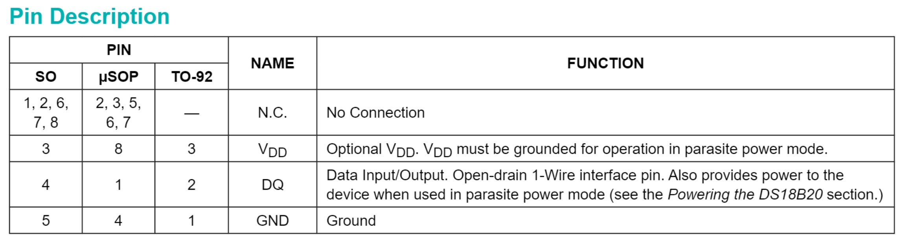
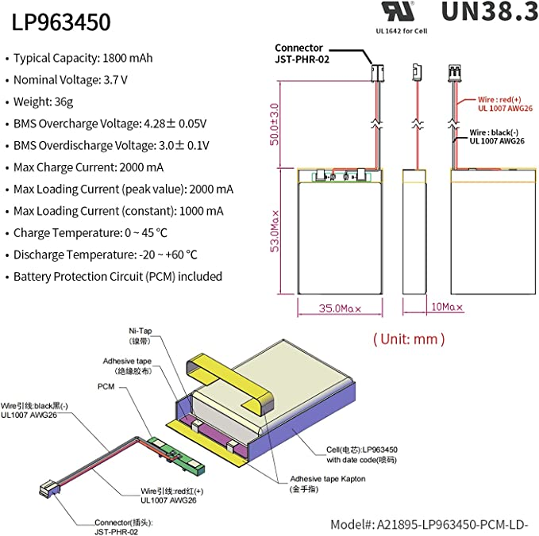
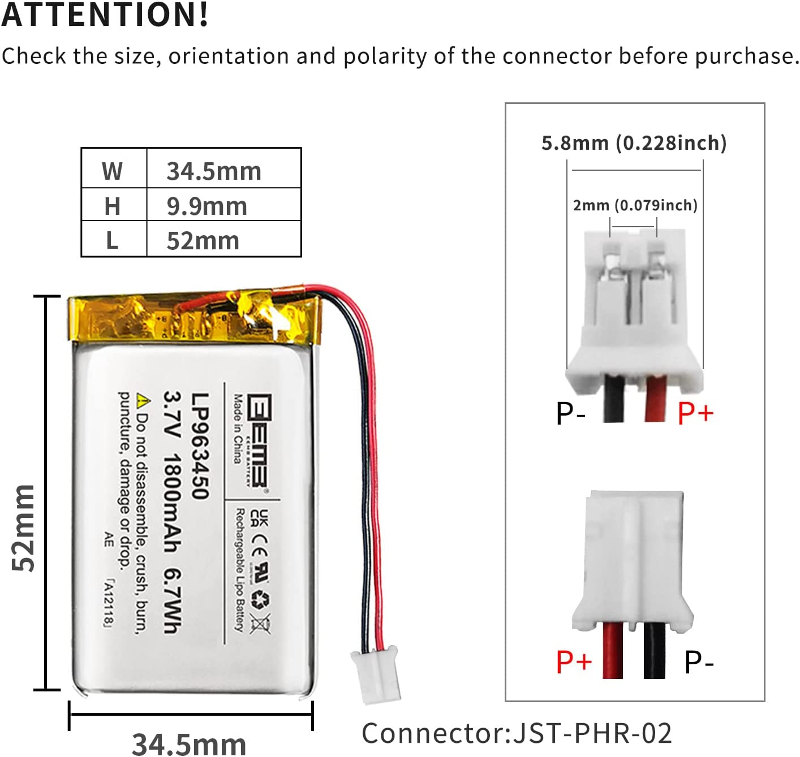

# Hardware Specifications
The following is a list of hardware that is needed to assemble the physical system. Any links that are provided are current as of the creation of this document and subject to change. 

## Microcontroller
Since low power consumption is required for this remote sensing unit, the following hardware was chosen.  
ESP8266 with WiFi  
### HiLetgo 1PC ESP8266 NodeMCU CP2102 ESP-12E ###  
"Development Board Open Source Serial Module Works Great for Arduino IDE/Micropython (Small)"  
$7.99 from Amazon as of 2/27/2023  
https://www.amazon.com/dp/B010O1G1ES?ref=ppx_yo2ov_dt_b_product_details&th=1  

Website:  
http://www.hiletgo.com/ProductDetail/1906570.html  

Firmware:  Not actively supported.
https://github.com/nodemcu/nodemcu-firmware  

Manufacturer Sample code from: http://www.nodemcu.com/index_en.html   

## Temperature Sensors  
A small profile, inexpensive temperature sesnsor that can easily be replicated using a single wire bus.
### 18B20 DS18B20 TO-92 3 Pins Wire Digital Thermometer Temperature ###  
 $9.99 for 10 from Amazon as of 3/5/2023  
 https://www.amazon.com/dp/B07MR71WVS?psc=1&ref=ppx_yo2ov_dt_b_product_details  
 This link may be to a knockoff: "Also it not an authentic DALLAS"  
 __Need pull up resistor of 4.7K ohm.__  
Technical specifications can be found here: [DS18B20 TO-92 3 Pin](Specification_Dcouments/604-00070-DS18B20-Manufacturer-Datasheet.pdf)
- Unique 1-Wire® Interface Requires Only One Port
Pin for Communication  
- Reduce Component Count with Integrated
Temperature Sensor and EEPROM  
- Measures Temperatures from -55°C to +125°C (-67°F to +257°F)  
- ±0.5°C Accuracy from -10°C to +85°C  
- Programmable Resolution from 9 Bits to 12 Bits  
- Voltage Range on Any Pin Relative to Ground -0.5V to +6.0V  
  
  
## Rechargeable Battery  
This module should be self powered and be able to run for extended periods of time that ideally could be in months. Solar re-charging may be required.  
### LP963450 EEMB Lithium Polymer Battery Rechargeable Battery Pack, 3.7V 1800 mAh with Wire JST ###
$16.99 from Amazon as on 3/5/2023  
https://www.amazon.com/dp/B08ZCQXFX4?ref=ppx_yo2ov_dt_b_product_details&th=1  
__THIS IS NOT UNIVERSAL!!! It will cause a short if the polarity of the battery connector does not match your device.__  
_Check the connection and switch leads as appropriate._  
* Voltage: DC 3.7V  
* Typical capacity: 1800 mAh, Min capacity: 1700 mAh  
*  Weight: 36 g  (~1.3 oz)
* Size: 34.5 x 52 x 9.9 mm (WxLxH) (1.36 x 2.05 x 0.39 inches)  
* PCM protection function: over charge, over discharge, over current, short circuit protection, over temperature protection  

  
  
 

